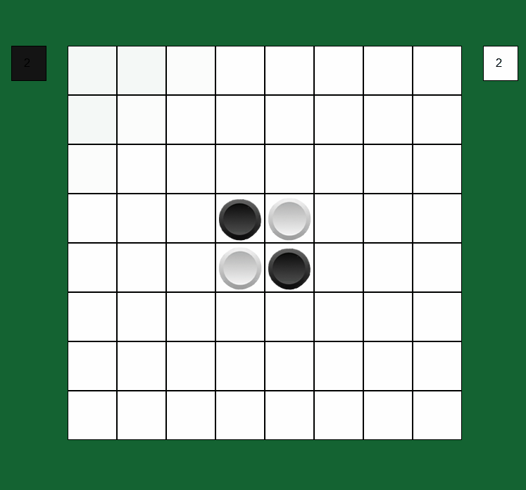

# Reversi (with AI)
Reversi is a strategy board game for two players, played on an 8×8 uncheckered board. There are sixty-four identical game pieces called disks (often spelled "discs"), which are light on one side and dark on the other. Players take turns placing disks on the board with their assigned color facing up. During a play, any disks of the opponent's color that are in a straight line and bounded by the disk just placed and another disk of the current player's color are turned over to the current player's color.
The object of the game is to have the majority of disks turned to display your color when the last playable empty square is filled.

  

## Tools
* Programming language C++ (https://en.wikipedia.org/wiki/The_C%2B%2B_Programming_Language)
* Code::Blocks IDE (www.codeblocks.org)
* Windows operating sistem (GUI Based on  WIN API)

### WIN API Game framework
Project contains very usefull Board/Card game framework maked in C++ using WIN API.

### AI
Based on every field points 

## Easy Run Instructions ( For non-developers )

Follow these instructions if you simply wish to run Reversi
**Prerequisites:** 

Windows operating sistem

1. Download folder content to any location of your choice:

    (https://github.com/SKantar/Reversi/tree/master/Seminarski/bin/Release)

2. Run it with mouse double click on :

    > WinAPI.exe
##  Standard Run Instructions (For Developers)

Follow These instructions if you wish to run 3D Platform and modify the source code
as well.

**Prerequisites:**

* Windows Operating sistem
* Code::Blocks IDE
* C++ compiler

**Note:** Reversi source code can be downloaded at: (https://github.com/SKantar/Reversi/tree/master/Seminarski).

1. Download project to any location of your choice
2. After opening the project in Code::Blocks, you can easily run the project

## Conclusion
*Works fast
*Dependent on the operating system (Windows)

